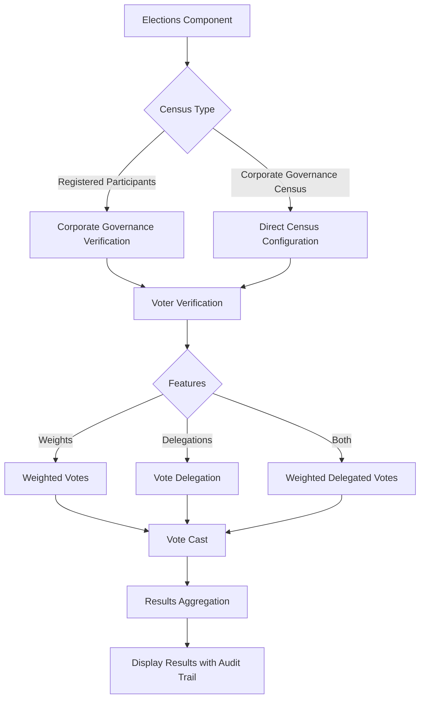

# Decidim::ActionDelegator

[![[CI] Lint](https://github.com/openpoke/decidim-module-action_delegator/actions/workflows/lint.yml/badge.svg)](https://github.com/openpoke/decidim-module-action_delegator/actions/workflows/lint.yml)
[![[CI] Test](https://github.com/openpoke/decidim-module-action_delegator/actions/workflows/test.yml/badge.svg)](https://github.com/openpoke/decidim-module-action_delegator/actions/workflows/test.yml)
[](https://qlty.sh/gh/openpoke/projects/decidim-module-action_delegator)
[](https://codecov.io/gh/openpoke/decidim-module-action_delegator)
[](https://badge.fury.io/rb/decidim-action_delegator)

A tool for Decidim that provides extended functionalities for cooperatives or any other type of organization that need to vote with weighted-vote results and/or vote-delegation.

Combines a CSV-like verification method with impersonation capabilities that allow users to delegate some actions to others.

Admin can set limits to the number of delegation per users an other characteristics.

Also, provides a Census handler for Decidim elections that uses the configuration of the verificator and shows results according weights and delegations.

## Dependencies

* [decidim-elections](https://github.com/decidim/decidim/tree/master/decidim-elections) `0.32.x`
* [decidim-admin](https://github.com/decidim/decidim/tree/master/decidim-admin) `0.32.x`
* [decidim-core](https://github.com/decidim/decidim/tree/master/decidim-core) `0.32.x`

## Installation

Add this line to your application's Gemfile:

```ruby
gem "decidim-action_delegator"
```

Or, if you want to stay up to date with the latest changes use this line instead:

```ruby
gem 'decidim-action_delegator', git: "https://github.com/openpoke/decidim-module-action_delegator"
```

Install dependencies:

```
bundle
bin/rails decidim:upgrade
bin/rails db:migrate
```

> **EXPERTS ONLY**
>
> Under the hood, when running `bundle exec rails decidim:upgrade` the `decidim-action_delegator` gem will run the following two tasks (that can also be run manually if you consider):
>
> ```bash
> bin/rails decidim_action_delegator:install:migrations
> ```

The correct version of Action Delegator module should resolved automatically by the Bundler.

Depending on your Decidim version, choose the corresponding Action Delegator version to ensure compatibility:

| Version | Compatible Decidim versions |
|---------|-----------------------------|
| 0.32.x  | 0.32.x                      |
| 0.9.x   | 0.31.x                      |
| 0.8.x   | 0.27.x                      |
| 0.7.x   | 0.26.x                      |
| 0.6.x   | 0.26.x                      |
| 0.5     | 0.25.x                      |
| 0.4     | 0.24.x                      |
| 0.3     | 0.24.x                      |
| 0.2     | 0.23.x                      |
| 0.1     | 0.22.0                      |

## Usage

This module works by providing a verification method (or authorization) and a user manager module that allows to create weighted votes, voters censuses, and vote delegations.

All of these configuration depend on a so called "setting", many of the can be created at the same time. But only one can be active at a time when using the same verification methods.


### Verification method

The verification method is called "Corporate Governance" (although the name might change under some circumstances).

Verification works by comparing if the user belongs to a predefined list of users for a particular setting. This comparison can be done via the email of the user, a phone number by checking an SMS or both.

So, if the user is in a list, then the verification will be granted.

As per the other features, weights and delegations, they only currently work with the Elections module.

### Weights in elections

Weights (or ponderations) work by assigning different multipliers to the vote value depending on the user. 

For this to work, you need to define the different type of weights in each setting and also the user list and which weight type is assigned to every user.

So, if you want to use this feature you need to make use of the participants list in the setting.

### Delegations in elections

Delegations are the action of letting someone else vote in your name. The way this works in the elections module is by effectively creating a vote for the user that has granted the delegation when the user benefiting from the delegation is voting. The traceability is performed through the Papertrail (Decidim's ActionLog) mechanism that stores the original user performing such action. So, at all effects, the vote is stored as it was performed by the original user.

Only the **grantee** (the user who casts the vote on someone else's behalf) needs to fulfil the verification configured for the election. The **granter** (the user who delegates) only needs to exist as a Decidim user — they are not required to be in the participants list nor to pass any verification. This applies to all combinations of census and verifier.

### Using settings in elections

There's two ways to configure a setting in the elections module:

1. By using the "Registered participants census" and selecting "Corporate Governance" as the verification method.
2. By using the built-in "Corporate Governance Census" directly.

#### Using "Registered participants census"

To use this method, just select the "Registered participants census" and then "Corporate Governance" as the verification method (you can use more than one method).

This method will force you to use the participants as the "source of truth" for the election. So, a user that **is not** in your participant's list for the specified setting won't be allowed to vote on their own behalf.

Note that this applies to the user casting the vote (including a grantee voting on someone else's behalf). The granter of a delegation is **not** required to be in the participants list (see "Delegations in elections" above).

This method allows you to use all the features of the module — delegations and weights as well.

#### Using "Corporate Governance Census"

This second method is for situations when you need delegations but don't need to use weights or to verify users through the participants list.

To use this method, select "Corporate Governance Census" as the election's census. Then you can optionally choose which verification methods you want to use. If you choose the "Corporate Governance" method, the participants list is used as the verifier for the user casting the vote (same as in "Registered participants census" above) — but the granter of a delegation is still not required to be in the list.

If you use another verification method (or none at all), then the participant's list is not used to verify identity at all. Delegations still work, weights only apply to users that are listed as participants with a ponderation; everybody else votes with the default weight of 1. Note that the participants list can be empty in this case.

## Configuration

By default, you can just get use ENV vars to automatically configure the plugin (although the default configuration is probably just what you need):

| ENV | Description | Example |
|---|---|---|
| AD_SMS_GATEWAY_SERVICE | Configure a custom class to send SMS with if you need it. Note that the built-in SMS gateway in Decidim takes precence if configured. | `Decidim::ActionDelegator::SmsGateway` |
| AD_AUTHORIZATION_EXPIRATION_TIME | Expiration time for the action authorization authorization. This is used to check if the user is in the census. In most cases is issued automatically. | 3 months |
| AD_ALLOW_TO_INVITE_USERS | Whether to allow admins to invite users from the admin interface. | `true` |
| AD_AUTHORIZE_ON_LOGIN | Automatically issue the action delegator authorization when the user logs in if is a member of some census (this does not work for phone verifications) | `true` |
| AD_PHONE_PREFIXES | List of prefixes to strip from user-entered phones to prevent duplications | `+34,0034,34` |
| AD_PHONE_REGEX | Phone Regex to check its validity | `^\d{6,15}$` (checks that it is a number between 6 and 15 chars) |


**ActiveJob Configuration**

This module can send invitations to users in order to register into the platform.
If you are using Sidekiq (or another queue processor), you need to make sure that the `invite_participants` queue is processed by Sidekiq.

For instance, this file should work for Sidekiq:

`config/sidekiq.yml`

```yaml
:concurrency: <%= ENV.fetch("SIDEKIQ_CONCURRENCY", "5").to_i %>
:queues:
  - [mailers, 4]
  - [invite_participants, 4]
  - [vote_reminder, 2]
  - [reminders, 2]
  - [default, 2]
  - [newsletter, 2]
  - [newsletters_opt_in, 2]
  - [conference_diplomas, 2]
  - [events, 2]
  - [translations, 2]
  - [user_report, 2]
  - [block_user, 2]
  - [metrics, 1]
  - [exports, 1]
  - [close_meeting_reminder, 1]
```

> **UPGRADE NOTES:**
>
> ### Migrating from decidim-consultations (deprecated since Decidim 0.28)
>
> If you have existing consultations, migrate them to the Elections component:
>
> ```bash
> # 1. Create an Elections component in Admin Panel → Participatory Space → Components
> #    Note the component ID from the URL
>
> # 2. Run migration for all consultations
> RAILS_ENV=production bundle exec rake action_delegator:migrate_consultations[COMPONENT_ID]
>
> # Or migrate a specific consultation
> RAILS_ENV=production bundle exec rake action_delegator:migrate_consultations[COMPONENT_ID,CONSULTATION_ID]
> ```
>
> **What gets migrated:** Consultations, questions, response options, votes, and all related settings (participants, delegations, weights).
>
> **Note:** After migration, verify results in the admin panel before removing old tables.
>
> Example:
> 

## Feature overview

This section complements the usage details above with a quick feature summary.

ActionDelegator does not provide new Components or Participatory Spaces but enhances existing ones.

Currently it integrates with the Elections module to add three key features:

- **Voter verification**: Provides a custom verification method that allows admins to restrict voting to users in a predefined census (uploaded via CSV). Each election can use a different census. This is optional and independent from weighted voting and delegations.

- **Weighted votes**: Each census can assign different weight multipliers to participants, allowing votes to be counted with varying influence based on membership type.

- **Vote delegation**: Participants can delegate their voting rights to others, with full traceability through audit logs.


- The election module can be configured with the built-in census:


- In elections, results are expanded with ponderation breakdowns (if configured):


#### Architecture Overview

Here's how the three features interact:



### Extended elections results

This gem modifies the election results page to add two extra columns:
`Membership type` and `Membership weight`. These are determined by the census and weight assignments for each participant.

### Authorization verifier and SMS gateway setup

The integrated authorization method is called "Delegations verifier". When an election uses the Corporate Verifier authorization, it validates whether the user is authorized and present in the census before allowing them to vote.

It supports three verification modes:

1. **Email only**: Verifies users by email. No SMS gateway required. The user is authorized if their email appears in the census.
2. **Email and phone**: Verifies users by email, then sends a verification code to their phone number (which cannot be changed by the user). Requires SMS gateway integration.
3. **Phone only**: Verifies users by phone number. The user enters their phone, and the system sends a verification code. Users can modify their phone number if it's not found in the census, allowing updates before verification. This mode is useful when email addresses change frequently.


To configure an SMS gateway for your application, you have two options:

**Option 1: Use Decidim's built-in SMS gateway**

In `config/initializers/decidim.rb`, set:

```ruby
config.sms_gateway_service = 'Decidim::ActionDelegator::SmsGateway'
```

> Note that if you use this method you will also be able to use Decidim's built-in SMS verification methods.

**Option 2: Use a dedicated SMS gateway**

Alternatively, use a gateway service dedicated only to this plugin. This approach lets you separate gateways or prevent Decidim admins from using the built-in SMS verification method. The plugin comes with this option preinstalled and requires only ENV variable setup.

#### Som Connexió

You can use Som Connexió as SMS provider which uses [this SOAP API](https://websms.masmovil.com/api_php/smsvirtual.wsdl). Reach out to Som Connexió to sign up first.

Then you'll need to set the following ENV vars:

```bash
SMS_USER= # Username provided by Som Connexió
SMS_PASS= # Password provided by Som Connexió
SMS_SENDER= # (optional) Name or phone number used as sender of the SMS
```

#### Twilio

Alternatively, you can use Twilio as your SMS provider by specifying the following ENV vars

```bash
TWILIO_ACCOUNT_SID # SID from your Twilio account
TWILIO_AUTH_TOKEN # Token from your Twilio account
SMS_SENDER # Twilio's phone number. You need to purchase one there with SMS capability.
```

#### Custom SMS gateways

It is also possible to use your own SMS gateway. In a new initializer (e.g., `config/initializers/action_delegator.rb`), set:

```ruby
Decidim::ActionDelegator.configure do |config|
  config.sms_gateway_service = 'YourOwnSmsGateway'
end
```

### Other configuration options

There are some other configuration options available, for more info check [action_delegator](lib/decidim/action_delegator.rb). These are the default values

```ruby
Decidim::ActionDelegator.configure do |config|
  # this is the SmsGateway provided by this module
  # Note that it will be ignored if you provide your own SmsGateway in Decidim.sms_gateway_service
  config.sms_gateway_service = "Decidim::ActionDelegator::SmsGateway"

  # The default expiration time for the integrated authorization
  # if zero, the authorization won't be registered
  config.authorization_expiration_time = 3.months

  # Put this to false if you don't want to allow administrators to invite users not registered
  # in the platform when uploading a census (inviting users without permission can be a GDPR offense).
  config.allow_to_invite_users = true

  # Used for comparing phone numbers from the census list with those entered by users.
  # Phone numbers are normalized before comparison, so +34 666 666 666, 0034666666666, and 666666666 are treated as equivalent.
  # Leave empty or null to disable prefix normalization.
  config.phone_prefixes = %w(+34 0034 34)

  # The regex for validating phone numbers
  config.phone_regex = /^\d{6,15}$/ # 6 to 15 digits
end
```

### Track delegated votes and unvotes

Votes and revocations done on behalf of other members are tracked through the
`versions` table using `PaperTrail`. This enables fetching a log of actions
involving a particular delegation or vote for auditing purposes. This
keeps out regular votes and unvotes.

When performing votes and unvotes of delegations you'll see things like the
following in your `versions` table:

```sql
  id  |          item_type      | item_id |  event  | whodunnit | decidim_action_delegator_delegation_id 
------+------------------------------+---------+---------+-----------+----------------------------------------
 2019 | Decidim::Election::Vote |     143 | destroy | 1         |                        22
 2018 | Decidim::Election::Vote |     143 | create  | 1         |                        22
 2017 | Decidim::Election::Vote |     142 | create  | 1         |                        23
 2016 | Decidim::Election::Vote |     138 | destroy | 1         |                        23
```

Note that `item_type` is `Decidim::Election::Vote` and `whodunnit` refers to a `Decidim::User` record. This enables joining `versions` and `decidim_users` tables, though it differs from Decidim's standard convention of using global IDs (gids) like `gid://decidim/Decidim::User/1`.

You can use `Decidim::ActionDelegator::ElectionsDelegatedVotesVersions` query object for
that matter:

```ruby
election = Decidim::Elections::Election.find 123
Decidim::ActionDelegator::ElectionsDelegatedVotesVersions.new(election).query.each do |v| 
  puts "#{v.item_type} | #{v.item_id} | #{v.event} | #{v.created_at} | #{v.decidim_action_delegator_delegation_id}"
end
```

## Contributing

Bug reports and pull requests are welcome on GitHub at https://github.com/openpoke/decidim-module-action_delegator.

### Developing

To start contributing to this project, first:

- Install the basic dependencies (such as Ruby and PostgreSQL)
- Clone this repository

Decidim's main repository also provides a Docker configuration file if you
prefer to use Docker instead of installing the dependencies locally on your
machine.

You can create the development app by running the following commands after
cloning this project:

```bash
bundle
DATABASE_USERNAME=<username> DATABASE_PASSWORD=<password> bundle exec rake development_app
```

Note that the database user has to have rights to create and drop a database in
order to create the dummy test app database.

Then to test how the module works in Decidim, start the development server:

```bash
DATABASE_USERNAME=<username> DATABASE_PASSWORD=<password> bin/rails s
```

Note that `bin/rails` is a convenient wrapper around the command `cd development_app; bundle exec rails`.

In case you are using [rbenv](https://github.com/rbenv/rbenv) and have the
[rbenv-vars](https://github.com/rbenv/rbenv-vars) plugin installed for it, you
can add the environment variables to the root directory of the project in a file
named `.rbenv-vars`. If these are defined for the environment, you can omit
defining these in the commands shown above.

#### Shakapacker notes

This repository uses Decidim's current Shakapacker-based asset pipeline. When
you modify JavaScript or CSS files, assets may need to be rebuilt.

If you want faster feedback while working on frontend assets, start the asset
watcher in a separate terminal before starting the Rails server:

```bash
bin/shakapacker-dev-server
```

#### Code Styling

Please follow the code styling defined by the different linters that ensure we
are all talking with the same language collaborating on the same project. This
project is set to follow the same rules that Decidim itself follows.

[Rubocop](https://rubocop.readthedocs.io/) linter is used for the Ruby language.

You can run the code styling checks by running the following commands from the
console:

```bash
bundle exec rubocop
```

To ease up following the style guide, you should install the plugin to your
favorite editor, such as:

- Sublime Text - [Sublime RuboCop](https://github.com/pderichs/sublime_rubocop)
- Visual Studio Code - [Rubocop for Visual Studio Code](https://github.com/misogi/vscode-ruby-rubocop)

#### Non-Ruby Code Styling

There are other linters for Javascript and CSS. These run using NPM packages. You can
run the following commands:

1. `npm run lint`: Runs the linter for Javascript files.
2. `npm run lint-fix`: Automatically fix issues for Javascript files (if possible).
3. `npm run stylelint`: Runs the linter for SCSS files.
4. `npm run stylelint-fix`: Automatically fix issues for SCSS files (if possible).

### Testing

To run the tests run the following in the gem development path:

```bash
bundle
DATABASE_USERNAME=<username> DATABASE_PASSWORD=<password> bundle exec rake test_app
DATABASE_USERNAME=<username> DATABASE_PASSWORD=<password> bundle exec rspec
```

Note that the database user has to have rights to create and drop a database in
order to create the dummy test app database.

In case you are using [rbenv](https://github.com/rbenv/rbenv) and have the
[rbenv-vars](https://github.com/rbenv/rbenv-vars) plugin installed for it, you
can add these environment variables to the root directory of the project in a
file named `.rbenv-vars`. In this case, you can omit defining these in the
commands shown above.

### Test code coverage

Running tests automatically generates a code coverage report. To generate the complete report run all the tests using this command:

```bash
bundle exec rspec
```

This will generate a folder named `coverage` in the project root which contains
the code coverage report.

### Localization

If you would like to see this module in your own language, you can help with its
translation at Crowdin:

https://crowdin.com/project/decidim-action-delegator-vote

## License

This engine is distributed under the GNU AFFERO GENERAL PUBLIC LICENSE.

## About

This plugin is currently maintained by [](https://pokecode.net)with much appreciated contributions from other companies.
